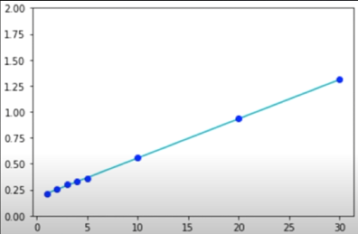
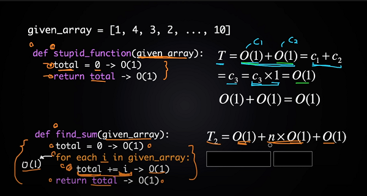
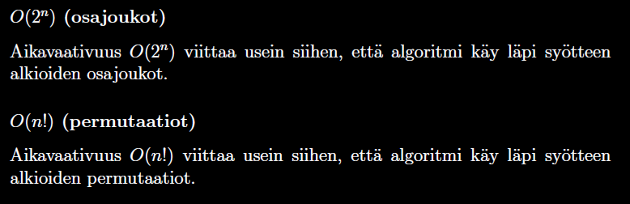

# Table of Contents
Author: Tatu Pesonen  
Created on: 09.01.2021  
Last updated on: 09.01.2021  
- [Table of Contents](#table-of-contents)
- [Links](#links)
  - [Links to course material](#links-to-course-material)
  - [Links to my own material I watched](#links-to-my-own-material-i-watched)
- [Book](#book)
  - [Introduction](#introduction)
  - [Time complexity](#time-complexity)
    - [Example usage of calculating functions efficiency](#example-usage-of-calculating-functions-efficiency)
  - [Equations to calculate time complexity](#equations-to-calculate-time-complexity)
    - [Time complexity for algorithms with loops is $O(n^k)$](#time-complexity-for-algorithms-with-loops-is-onk)
  - [Common time complexities](#common-time-complexities)
    - [Constant time](#constant-time)
    - [Logarithmic](#logarithmic)
    - [Linear](#linear)
    - [Sorting](#sorting)
    - [Quadratic](#quadratic)
    - [Some other time complexities](#some-other-time-complexities)
  - [Estimating efficiency](#estimating-efficiency)
  - [Implementing a $O(n^2)$ algorithm versus $O(n)$](#implementing-a-on2-algorithm-versus-on)
    - [Solving the CS Dojo array 2d sum challenge and analyzing the algorithm](#solving-the-cs-dojo-array-2d-sum-challenge-and-analyzing-the-algorithm)
    - [Solving my friend's math problem](#solving-my-friends-math-problem)
  - [Big O Notation](#big-o-notation)

# Links
## Links to course material
[Tietorakenteet ja algoritmit syksy 2020](https://tira.mooc.fi/syksy-2020/pages/materiaali.html)

## Links to my own material I watched
[CS Dojo](https://www.youtube.com/watch?v=D6xkbGLQesk)
[Some StackOverFlow post](https://cs.stackexchange.com/questions/74936/understanding-constants-in-big-o-notation)  
^ (pretty confusing if you ask me, still)

# Book

## Introduction
> "Using these basic building blocks of programming, any algorithm can be created."
> 
> "An algorithm can be considered *good* if it outputs fast with given large input (so the n is big!)"

List of programming constructs that the quote refers to:
* Variables
* Conditional statements
* Loops
* Arrays (Lists)
* Functions (called procedures for functions with no return type)
    * Recursion, but this is a part of functions

[Source](https://www.youtube.com/watch?v=__vX2sjlpXU)

## Time complexity
Time complexity can tell us how as certain algorithm's runtime increases as the input size grows.  
Below is an image of a function of $O(n)$ (so linear time!)  

### Example usage of calculating functions efficiency

```
1 laskuri = 0
2 for i = 0 to n-1 //n
3   if luvut[i] == x //2n
4       laskuri += 1 //3n
```
Given the following algorithm, the efficiency is as follows:  
Best case: 2n + 1
Worst case: 3n + 1

According to the book, this kind of algorithm analysis is more precise than we need here.  
You may occasionally need more accurate analysis methods, though.

## Equations to calculate time complexity
Example from CS Dojo  
  
Fastest growing term is $n*c_5$
Removing the coefficient, $n$
$$
T_2 = O(1)+n*O(1)+O(1) \\ T_2 = c_4+ n*c_5 \\ T_2 = O(n)
$$

**Single commands**  
If the code doesn't have loops but only commands, time complexity is O(1).  
Example:
```
c = a+b
if c >= 0
    print(c)
```
Code that has a time complexity of O(1) is often left out with `...`

**Loops**  
k = Amount of nested loops. In this example, time complexity is $O(n^2)$
```js
for (let i = 0; i < n; i++) {
    for (let j = 0; i < n; j++) {
        ...
    }
}
```
### Time complexity for algorithms with loops is $O(n^k)$
You can use the following formula to calculate time complexity for [quadratic](#Quadratic) and [cubic](#Cubic) algorithms aswell.
Where n is the input size and k is the amount of nested loops.

**Algorithms one after another**
Code segments after each other have the time complexity of the function with largest time complexity in the algorithm.

```python
for i = 1 to n #O(n)
...
for i = 1 to n
    for j = 1 to n #O(n^2)
...
for i = 1 to n #O(n)
```
So the time complexity for this algorithm is $O(n^2)$ because it is the segment with the largest time complexity.

**Multiple variables**
```js
for(let i = 1; i < n; i++) {
    for(let j = 1; i < m; j++) {
        ...
    }
}
```
Time complexity for this function is $O(nm)$

**Recursive algorithms**
```js
function f(n) {
    if (n === 1) return
    f(n-1)
}
```
Function is called $n$ times and each call takes $O(1)$ amount of time.  
The time complexity of the recursive algorithm is calculated by multiplying those values:  
$O(1) * O(n) = O(n)$, so the function time complexity is $O(n)$.
***
Example with another recursive algorithm 
```js
function g(n) {
    if (n === 1) return
    g(n-1)
    g(n-1)
}
```
Calling this function would result in the following time complexity:
$$
1+2+4+...+2^{n-1}=2^n-1
$$
Each call takes $O(1)$ of time so the time complexity is $O(1) * O(2n) = O(2^n)$

## Common time complexities

### Constant time
$O(1)$ (constant time)  
In $O(1)$ algorithms, the size of input doesn't affect algorithm speed.
```js
const sumOfNumbersBeforeN = n => n*(n+1)/2 //15 given n of 5
```

### Logarithmic
$O(\log n)$ (logarithmic)  
A logarithmic algorithm usually halves the input on each step.
```js
let counter = 0;
while (n >= 1) {
    counter++
    n = n / 2
}
```
$\log{{_2}^n}$ algorithm
> "An important factor related to logarithms is that $\log n$ is a small number, whereas $n$ is any number that usually shows up in algorithms."

Logarithmic functions halve input on each iteration, so they are efficient.

### Linear
$O(n)$
```js
let sum = 0
let arr = [...]; //arr.length is size of n
for(let i = 0; i < arr.length; i++) {
    sum = sum + arr[i]
}
```
Given an array of size $n$, linear time complexity is often the best that can be achieved.  
This is because the algorithm has to check the input at least once before it can return a value.

### Sorting
$O({n}\log{n})$
```js
let array1 = [...] //This function is O(n log n)
let same = false
array1.sort() //Sorting the array here
for(let i = 0; i < array1.length; i++) {    |
    if(array1[i] === array1[i-1])           | //This section is O(n)
        same = true                         |
}
```
This example sorts the array first with a $O({n}\log{n})$ time complexity sort algorithm so all the indices are next to each other.  
**Remember that the time complexity of an algorithm is the largest time complexity "chunk" in that algorithm.**

### Quadratic
```js
let arr = [...]
let x = ?
let ok = false
let iters = 0;
for(let i = 0; i < arr.length; i++) {
    for(j = i+1; j < arr.length; j++) {
        if(arr[i] + arr[j] === x)
            ok = true
            iters++
    }
}
console.log(iters, ok)
```
To calculate the time complexity of quadratic & cubic algorithms you can use [$O(n^k)$](#time-complexity-for-algorithms-with-loops-is-onk).

### Some other time complexities


## Estimating efficiency
Estimating the efficiency of an algorithm gives us as an estimate on how *good* an algorithm is, so how big of an input we can have and still process it efficiently.

| Size of input n | Needed time complexity |
|----------------:|-----------------------:|
|              10 |                  O(n!) |
|              20 |                  O(2^n) |
|             500 |                  O(n^3) |
|            5000 |                  O(n^2) |
|            10^6 |     O(n) or O(n log n) |
|             big |       O(1) or O(log n) |

Big O notation is an estimate, it is a concise "rating" you can give to an algorithm that tells you how big of an input ($n$) you should/can use for it.

>"Yksi kiinnostava näkökulma algoritmin tehokkuuteen on, miten suuren
syötteen algoritmi voi käsitellä nopeasti (noin sekunnissa)."

>"A good implementation of an algorithm can be tens of times faster than a bad implementation."

## Implementing a $O(n^2)$ algorithm versus $O(n)$
First, the naive $O(n^2)$ implementation in JavaScript.
```js
let counter = 0
let iters = 0
let n = '01001' //input
for (let i = 0; i < n.length; i++) {
    for (let j = i + 1; j < n.length; j++) {
          iters++
          if (n.charAt(i) === '0' && n.charAt(j) === '1') {
            counter++
        }
    }
}
console.log(counter, iters) //Counter is 4, took 10 iterations to complete
```

Then, let's compare it to the $O(n)$ algorithm.
```js
let n = '01001' //input
let counter = 0
let zeros = 0
for (let i = 0; i < n.length; i++) {
    if(n.charAt(i) === '0')
        zeros++
    else
        counter += zeros
}
console.log(counter)
```

Example of how execution looks on $O(n)$ algorithm.
```python
i = 0  
counter = 0  
zeros = 1 
01001  
^
------
i = 1  
counter = 1  
zeros = 1  
01001  
 ^  
------
i = 2  
counter = 1  
zeros = 2  
01001  
  ^  
------
i = 3  
counter = 1  
zeros = 3  
01001  
   ^  
------
i = 4  
counter = 4  
zeros = 3  
01001  
    ^  
```
Comparison between the functions in JavaScript repl.it.  
[Source Code](experiments/BigO.js)  
vso(n^2).png)

Ran it on my own computer with input size of 10^5  
vso(n^2)withInputSize10^5.png)

### Solving the CS Dojo array 2d sum challenge and analyzing the algorithm

### Solving my friend's math problem
```js
let arr = 
function iterativeMergeSort(arr) {

}
```

## Big O Notation
The $O(n)$ is simplified analysis of an algorithm's efficiency.
1. Complexity in terms of input size, $n$
2. Machine-independent
3. Basic computer steps
4. Time & space

